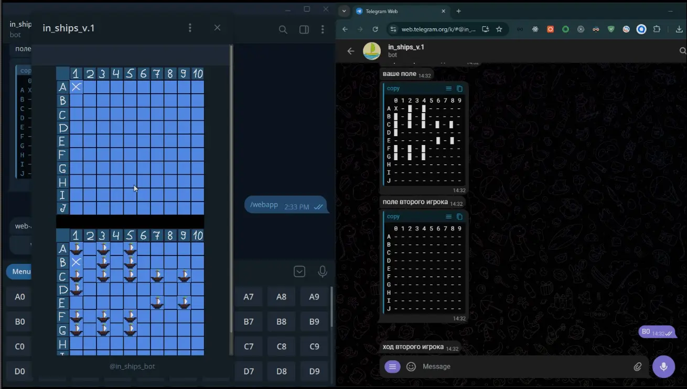

# In_ships_bot (telegram-bot)

### Video preview:

### Client repository:
https://github.com/ghstd/t_bot_ships
### WebApp repository:
https://github.com/ghstd/t_web_ships

### Description:
Telegram bot is a game of 'sea battle' in the telegram chat between two users, in addition to text messages, it can also use a web interface, supports only one session.

### Resources used:
- https://app.netlify.com/functions
- https://render.com
- https://firebase.google.com -> Firestore Database
